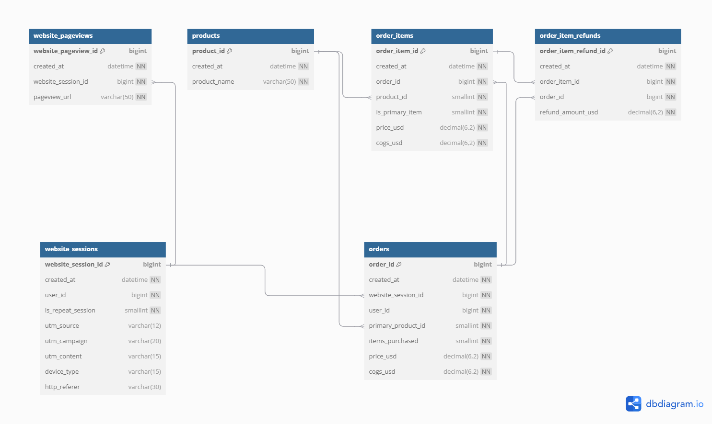

# Making business context from SQL using the **READ** Framework

Imagine setting off on a cross‑country road trip without a map or GPS.  
You might eventually get somewhere, but you’ll waste a lot of time and gas or perhaps getting lost.  
The **READ** framework is your SQL roadmap:

1. **R**elationships - plot the highways (your schema)  
2. **E**stablish Context - choose your destination (business question)  
3. **A**ssemble Query - hit the road (SQL code)  
4. **D**eliver Insights - reach your destination (actionable findings)  

Buckle up—let’s apply **READ** to a six‑table e‑commerce database(*) and take one trip: **Revenue per Session by Channel**.

  
---

## R: Relationships  
***Plot the Highways***

Before writing any SQL, visualize how your tables connect—your roadmap for joins.  
Below is the streamlined description of each table (primary keys in **bold**, foreign keys in _italics_).

| Table | Key Columns | Purpose |
|-------|-------------|---------|
| **website_sessions** | `website_session_id`, `created_at`, `user_id`, `is_repeat_session`, `utm\_source`, `utm\_campaign`, `utm\_content`, `device_type`, `http_referer` | Each visit to the site |
| **website_pageviews** | `website_pageview_id`, `created_at`, `_website_session_id_`, `pageview_url` | Every page hit within a session |
| **products** | `product_id`, `created_at`, `product_name` | Product catalog |
| **orders** | `order_id`, `created_at`, `_website_session_id_`, `user_id`, `_primary_product_id_`, `items_purchased`, `price_usd`, `cogs_usd` | One record per checkout |
| **order_items** | `order_item_id`, `created_at`, `_order_id_`, `_product_id_`, `is_primary_item`, `price_usd`, `cogs_usd` | Line items inside each order |
| **order_item_refunds** | `order_item_refund_id`, `created_at`, `_order_item_id_`, `_order_id_`, `refund_amount_usd` | Refunds at the item level |

> **Chart #1**  
> _ER diagram: sessions → pageviews; sessions → orders → order_items → refunds; and orders / order_items → products.
> 
> 
> _

**Key flows**

* **Session → Pageview** – captures on‑site behaviour.  
* **Session → Order** – ties purchase back to the visit that triggered it.  
* **Order → Items / Refunds** – lets you measure profit or loss per SKU.  

---

## E: Establish Context  
***Choose Your Destination***

Every road trip has a goal; in SQL your goal is a crisp business question.  
Map each table to the questions it can answer:

| Table | Key Fields | Example Business Questions |
|-------|------------|----------------------------|
| **website_sessions** | website_session_id, created_at, utm\_source, utm\_campaign, device_type | 1. Marketing mix: Which UTM campaigns bring in the most first‑time vs. repeat sessions? <br> <br> 2. Device ROI: How does conversion rate and AOV differ across desktop, mobile, and tablet traffic? |
| **website_pageviews** | website_pageview_id, created_at, website_session_id, pageview_url |1. Landing‑page lift: Which first pageview URLs deliver the highest session‑to‑order conversion rate? <br> <br>  2. User journey depth: What’s the average number of pageviews before purchase, and how does that vary by UTM campaign? |
| **products** | product_id, created_at, product_name | 1. Launch traction: Among products released in the last 30 days, which generated the most revenue in their first week? <br> 2. Refund hot‑spots: Do certain product lines show above‑average refund rates? |
| **orders** | order_id, created_at, website_session_id, primary_product_id, items_purchased, price_usd, cogs_usd | 1. Margin by source: What’s the average gross margin (price_usd – cogs_usd) by marketing channel? <br> <br>  2. Basket size: How many items are purchased per order for new vs. returning customers? |
| **order_items** | order_item_id, product_id, is_primary_item, price_usd, cogs_usd | 1. Attach‑rate winners: Which add‑on items ( is_primary_item = 0 ) most often ride along with specific primary products <br> <br> 2. Profit drivers: Which SKUs contribute the most to total gross profit? |
| **order_item_refunds** | order_item_refund_id, refund_amount_usd | 1. Refund burden: What percentage of revenue is refunded for each product (or product family)? <br> <br> 2. Refund timing: How many days elapse, on average, between purchase and refund request? |

> Pick one question per analysis; it keeps the SQL lean and the story clear.

---

## A: Assemble Query  
***Hit the Road***

Let’s answer this question:

> **Which traffic source delivers the highest revenue per session?**

```sql
SELECT
  s.utm_source                                   AS traffic_source,
  COUNT(DISTINCT s.website_session_id)           AS total_sessions,
  ROUND(
    SUM(o.price_usd)::NUMERIC
      / NULLIF(COUNT(DISTINCT s.website_session_id), 0),
    2
  )                                              AS avg_revenue_per_session
FROM website_sessions AS s
LEFT JOIN orders AS o
  ON s.website_session_id = o.website_session_id
  -- Optional: constrain to orders placed within X hours of the session
  -- AND o.created_at BETWEEN s.created_at AND s.created_at + INTERVAL '4 hours'
GROUP BY s.utm_source
ORDER BY avg_revenue_per_session DESC;
```

## D: Deliver Insights
***Reach your destination***

 | Traffic Source | Avg. Revenue / Session (\$) |
| -------------: | --------------------------: |
|    Paid Search |                        4.25 |
|       Referral |                        3.10 |
|        Organic |                        2.10 |
|         Direct |                        1.75 |
|         Social |                        1.50 |

> Pit‑Stop Recommendations
> - Boost Paid Search – $4.25 / session is your highest ROI; consider scaling budget or refining landing pages.
> - Expand Referrals – $3.10 / session suggests strong partner potential; explore affiliate programs.
> - Optimize Organic & Social – lower yields hint at UX or content tweaks; run A/B tests

## Recap
With READ as your compass, every SQL project is:

**Ready**: you know the map

**Exact**: you have a destination

**Actionable**: the query is precise

**Decisive**: insights guide next moves

Plot your next trip—cohort retention, churn drivers, product bundling—and let READ keep you on course.

Happy querying!


(*) The original dataset is from [Maven Analytics](https://app.mavenanalytics.io/) - Course: Advance MySQL for Marketing & Web Analytics