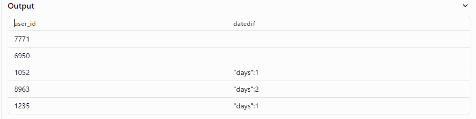
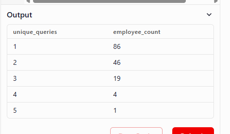

# [IBM db2 Product Analytics](https://datalemur.com/questions/sql-ibm-db2-product-analytics)

## Description
IBM is analyzing how their employees are utilizing the Db2 database by tracking the SQL queries executed by their employees. The objective is to generate data to populate a histogram that shows the number of unique queries run by employees during the third quarter of 2023 (July to September). Additionally, it should count the number of employees who did not run any queries during this period.

Display the number of unique queries as histogram categories, along with the count of employees who executed that number of unique queries.

**`queries`** Schema:
| Column Name |	Type |	Description |
|-- | -- | -- |
|employee_id|	integer|	The ID of the employee who executed the query.
query_id|	integer|	The unique identifier for each query (Primary Key).
query_starttime|	datetime|	The timestamp when the query started.
execution_time|	integer|	The duration of the query execution in seconds.

**`employees`** Schema:
Assume that the table below displays all employees in the table:

|Column Name|	Type|	Description|
|-- | -- | -- |
|employee_id|	integer|	The ID of the employee who executed the query.
|full_name|	string|	The full name of the employee.
|gender|	string|	The gender of the employee.

## Thoughts process:
- Number of unique queries 
- July - September 2023 -> 
- count number of employees who did not run any queries
  - how to this information? 
    - count number of employee_id from `employees` then minus count distinct  employee_id from `queries`

- group by unique_queies 

```
SELECT
employee_id
,count (DISTINCT query_id) as unique_queries
FROM queries
where EXTRACT(MONTH from query_starttime) BETWEEN 07 and 09 
and EXTRACT(YEAR from query_starttime) = 2023
group by employee_id
order by unique_queries DESC ;
```


=> this query give me the table of the number of unique_queries by each users => to get the number of employee_id for each unique_querries value => group by unique_queries with count(employee_id)

```
SELECT 
unique_queries
, count (employee_id) as employee_count 
from (SELECT
employee_id
,count (DISTINCT query_id) as unique_queries
FROM queries
where EXTRACT(MONTH from query_starttime) BETWEEN 07 and 09 
and EXTRACT(YEAR from query_starttime) = 2023
group by employee_id
order by unique_queries DESC) as Table1 
group by unique_queries ;
```



To get the number of employee who do not make queries => use left join where `employees` table is on the left side thus I  can keep all the employeeId value that not appear in `queries` table 
