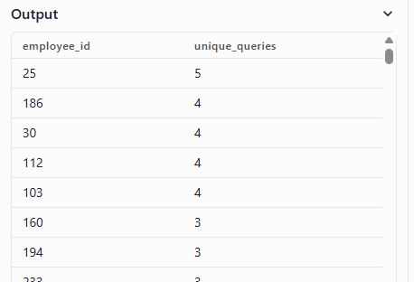

[Question link](https://datalemur.com/questions/second-day-confirmation)

Assume you're given tables with information about TikTok user sign-ups and confirmations through email and text. New users on TikTok sign up using their email addresses, and upon sign-up, each user receives a text message confirmation to activate their account.

Write a query to display the user IDs of those who did not confirm their sign-up on the first day, but confirmed on the second day.

**Definition**:

- action_date refers to the date when users activated their accounts and confirmed their sign-up through text messages

`emails` table:
|column Name| Type |
|-- | -- |
| email_id | integer |
| user_id | integer |
| signu_date | datatime |

`texts` table:
|Column Name |	Type |
|-- | -- |
|text_id |	integer |
|email_id |	integer |
|signup_action |string ('Confirmed', 'Not confirmed') |
|action_date | datetime |

## Thought process

- need to return calculate value with a list of user_id that match the criterias
- join table with email.id as a common variable. 2 columns are signup_date `emails` and action_date `texts`
- check for  action_date - signup_date = 1 
  -  without using extract('day' from .... ) the result return
  
- check for signup_action = "Confirmed"\
- select  user_id `emails`

## Solution
```
SELECT 
e.user_id
FROM emails AS e
LEFT JOIN texts AS t 
ON e.email_id  = t.email_id
WHERE t.signup_action = 'Confirmed'
and EXTRACT(DAY from t.action_date - e.signup_date) = 1
```