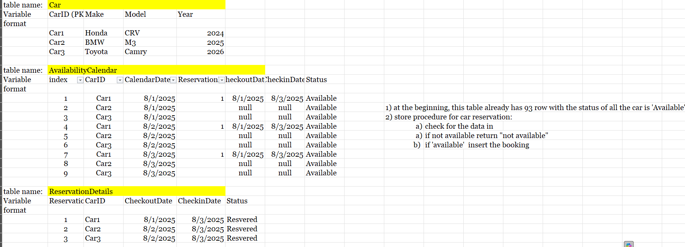
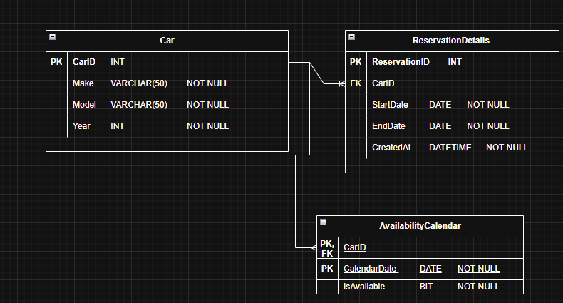

# Project Summary

This term project for the Relational Database Design and SQL (COMP 1630) course at BCIT involves designing and implementing a database for a car‑rental business. The solution comprises three core tables:

- **Cars**: vehicle details
- **Reservations**: customer bookings
- **Availability**: daily vehicle availability

**Deliverables:**

- A stored procedure (`ReservationDetails`) to handle new reservations
- SQL queries to extract key business insights

# Analysis Process

1. **Mock data creation:** Build sample datasets in Excel to capture business rules and table relationships.



1. **Schema design:** Model the database with an Entity‑Relationship Diagram (ERD).



1. **Database setup:** Write DDL scripts to create tables, keys, and constraints.
    
    ```sql
    CREATE TABLE Car (
    	CarId		INT				PRIMARY KEY, 
    	Make		VARCHAR(50)		NOT NULL, 
    	Model		VARCHAR(50)		NOT NULL, 
    	Year		INT				NOT NULL
    )
    
    CREATE TABLE AvailabilityCalendar (
    	CarId		INT				NOT NULL,  
    	CalendarDate	DATE		NOT NULL, 
    	IsAvailable	BIT				NOT NULL
    	CONSTRAINT DF_AvCal_IsAvailable DEFAULT 1, 
    	PRIMARY KEY (CarId, CalendarDate), 
    	FOREIGN KEY (CarId) REFERENCES Car(CarId) 
    ) 
    
    CREATE TABLE ReservationDetails (
    	ReservationId	INT			IDENTITY PRIMARY KEY,  
    	CarId			INT			NOT NULL,
    	StartDate		DATE		NOT NULL,  
    	EndDate			DATE		NOT NULL,  
    	CreatedAt		DATETIME	NOT NULL  
    	CONSTRAINT DF_Res_CreatedAt DEFAULT GETDATE(), 
    	CONSTRAINT FK_Res_Car FOREIGN KEY (CarId) REFERENCES Car(CarId), 
    	CONSTRAINT CK_Res_Dates CHECK (StartDate <= EndDate) 
    )
    ```
    
2. **Data population & procedures:** Insert sample data and develop the `ReservationDetails` stored procedure.
    
    ```sql
    CREATE OR ALTER PROCEDURE dbo.sp_ReserveCar
      @CarId     INT,
      @StartDate DATE,
      @EndDate   DATE
    AS
    BEGIN
      SET NOCOUNT ON;
    
      BEGIN TRANSACTION;
    
      -- 1. Lock and check availability
      IF EXISTS (
        SELECT 1
        FROM AvailabilityCalendar WITH (UPDLOCK, HOLDLOCK)
        WHERE CarId = @CarId
          AND CalendarDate BETWEEN @StartDate AND @EndDate
          AND IsAvailable = 0
      )
      BEGIN
        ROLLBACK;
        RAISERROR('Car is not available for the requested dates.', 16, 1);
        RETURN;
      END
    ```
    
3. **Data analysis:** Craft SQL queries to report on reservations, utilization, and availability.
    
    ```sql
    --  a. List of all cars available for reservation on a specific date.
    select CarId
    from AvailabilityCalendar
    where CalendarDate = '2025-08-10'
    and IsAvailable = 1
    
    -- b. List of all reservations made for a specific car.
    select
    ReservationId
    ,StartDate
    ,EndDate
    from ReservationDetails
    where CarId = 1
    
    -- c. List of all cars reserved in the month of August 2025.
    select 
    CalendarDate
    ,max(case when CarId = 1 then 1 else 0 end) as Car_1
    ,max(case when CarId = 2 then 1 else 0 end) as Car_2
    ,max(case when CarId = 3 then 1 else 0 end) as Car_3
    from AvailabilityCalendar
    where IsAvailable = 0
    group by CalendarDate
    order by CalendarDate asc
    
    ```